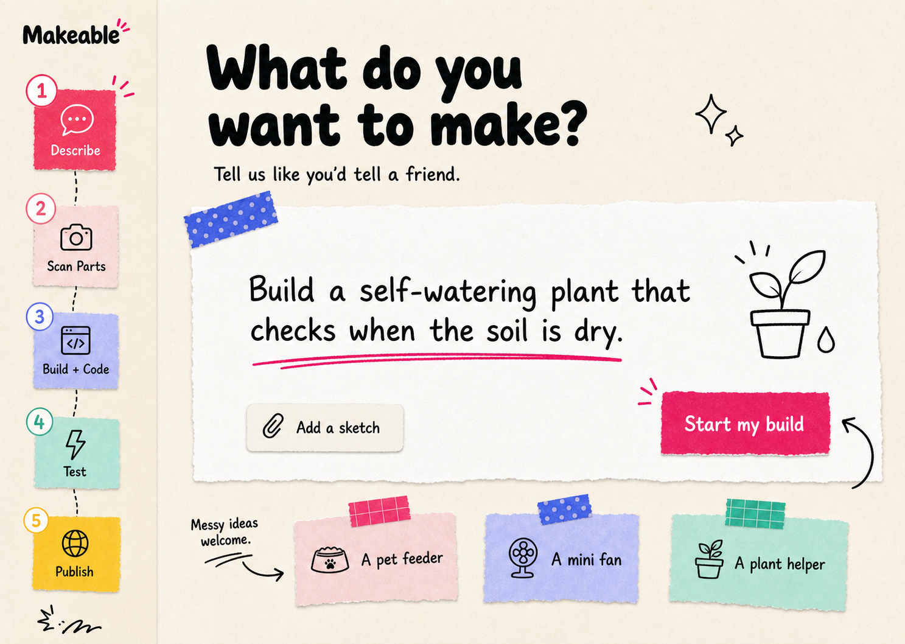

# Makeable

## Codex For Hardware

**Makeable** is an AI hardware-building buddy that turns messy IoT prototyping into a fun, LEGO-like experience.

Building with ESP32s can feel scary when you are new: sensors, wires, pin diagrams, Arduino setup, firmware, flashing, terminal logs, and debugging all show up at once. Makeable turns that chaos into a friendly step-by-step build guide using your own parts photo.

Upload a photo. Say what you want to build. Let Makeable guide the rest. 🧩⚡

Makeable deliberately supports the **ESP32 family only**: ESP32, S2, S3, C3, and C6. Arduino Uno/Nano/Mega and other microcontroller families are not accepted as build targets.



---

## The Big Idea 💡

Instead of making beginners jump between wiring diagrams, Arduino IDE, random tutorials, and serial monitors, Makeable keeps the whole hardware journey in one place.

It can:

- 📸 Look at your real parts photo
- 🧠 Identify only the components your project needs
- 🏷️ Label the useful parts directly on the image
- 🔌 Walk you through the wiring one move at a time
- 💻 Generate ESP32 firmware for your idea
- 🚀 Flash the code into the board without touching Arduino IDE
- 👀 Debug the real build using terminal logs and webcam evidence
- 📚 Package the final project into GitHub documentation

---

## Why We Built It 🛠️

Tiny hardware mistakes can break the whole project.

Wrong pin? Nothing works.

Missing ground? Mystery bug.

Bad code upload? More confusion.

Serial log error? Time to panic-scroll forums.

Makeable is designed to feel like a calm friend beside you saying:

> “No worries. Pick up this wire. Put it here. I’ll check the next part with you.”

That is the heart of **Codex For Hardware**.

---

## Visual Proof: The Build Journey 🧪

### 1. Start With What You Have 📸

Lay out your parts, upload one clear photo, then type or speak the thing you want to make.

In this demo, the user wants a motion-triggered light build.


### 2. AI Finds the Useful Parts 🧠

Makeable reads the photo and focuses on the parts needed for the project. Extra parts are ignored so the screen does not become label soup.


### 3. One Connection at a Time 🔌

The guide does not dump every wire on you at once. It highlights the current move, shows the exact parts on your own photo, and keeps the instruction simple.


### 4. A Clean Final Guide ✅

Each step is built around the photo, the selected parts, and a clear action. It feels closer to LEGO instructions than a scary circuit diagram.


### 5. Connect the Board 🔌

Connect the ESP32 by USB. Makeable infers the supported board target from the recognized hardware; ordinary users do not see compiler settings or source code.

### 6. Flash the Code Into the Board 🚀

The app generates firmware and loads it directly into the ESP32. No Arduino IDE adventure required.


### 7. Closed-Loop Debugging 👀⚡

After flashing, Makeable can check terminal logs and webcam footage to confirm the physical project is actually doing what it should.


### 8. One-Click GitHub Documentation 📚

When the build works, Makeable packages the project into GitHub-friendly documentation so it is easy to save, share, and show off.


---

## What Makes It Different ✨

| Old Hardware Workflow 😵 | Makeable Workflow ✨ |
| --- | --- |
| Search for wiring diagrams | Upload your own parts photo |
| Guess which parts matter | AI marks only the needed parts |
| Read a giant pinout chart | Follow one small move at a time |
| Copy random Arduino code | Generate firmware for your exact idea |
| Manually compile and flash | Load code directly into the ESP32 |
| Debug alone with serial logs | AI checks logs + webcam evidence |
| Write docs after everything | One-click GitHub documentation |

---

## Core Features 🌟

### 📷 Photo-Based Part Detection

Makeable uses the user’s real photo as the source of truth. The guide is not generic. It points to the actual objects on the table.

### 🪜 Step-by-Step Wiring

The guide shows one connection at a time so beginners can move slowly and confidently.

### 💻 Secure Firmware Generation

The app generates ESP32-ready firmware based on the project goal and detected components. The source stays inside the Makeable workflow.

### 🔌 Direct Flashing

The Render container owns Arduino CLI, the ESP32 core, and common libraries. The browser receives a compiled binary and flashes it with Web Serial, so the user installs no IDE, CLI, extension, or SDK.

### 👀 Closed-Loop Debugging

The app can inspect serial logs and webcam evidence, then explain whether the physical build is behaving correctly.

### 📚 GitHub Export

The final project can be packaged into a shareable README and uploaded to GitHub.

---

## Tech Stack 🧰

- **Frontend:** HTML, CSS, JavaScript
- **AI planning:** OpenAI Responses API
- **Voice input:** Deepgram transcription with short-lived server-issued browser tokens
- **Firmware compile:** pinned Arduino CLI + ESP32 core in a Render Docker container
- **Board flashing:** Web Serial + ESP flashing flow
- **Debugging:** Serial logs + webcam evidence
- **Publishing:** GitHub API
- **Hosting:** Netlify frontend + Render build/API service

---

## Local Development 🏃

```bash
npm run toolchain:install
node server.mjs
```

Then open:

```text
http://127.0.0.1:8787
```

Chrome or Edge is required for Web Serial board flashing. This local setup is only for Makeable developers; end users visit `makeable.build` and install nothing.

---

## Environment Setup 🔐

Create a `.env` file:

```bash
OPENAI_API_KEY=
OPENAI_MODEL=gpt-5.6-sol
OPENAI_REASONING_MODEL=gpt-5.6-sol
OPENAI_REASONING_EFFORT=high

DEEPGRAM_API_KEY=

GITHUB_TOKEN=
GITHUB_OWNER=

ARDUINO_CLI_PATH=.makeable/toolchain/bin/arduino-cli

PORT=8787
```

`npm run toolchain:install` installs the pinned CLI and ESP32 core into the ignored `.makeable/toolchain` development directory. Production gets the same toolchain from `Dockerfile`.

---

## Beginner Safety Notes 🧯

- Power the board by USB first.
- Always connect ground before trusting signal wires.
- Double-check the board pin labels before flashing.
- Disconnect power before changing messy wiring.
- If something gets hot, stop immediately.

Hardware should feel fun, not frightening. ⚡

---

## Project Vision 🌈

Makeable is not just a code generator.

It is a hardware companion that watches the whole loop:

```text
parts photo → AI guide → wiring steps → firmware → flashing → real-world check → GitHub docs
```

The dream is simple:

> Anyone should be able to build useful electronics without feeling lost in the wires.

---

## Name

**Makeable**<br>
**Tagline:** Codex For Hardware

Small tool. Big hardware confidence. ⚡
